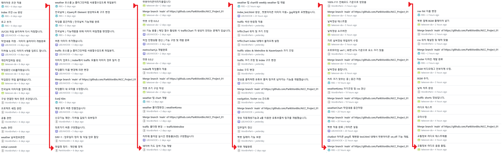
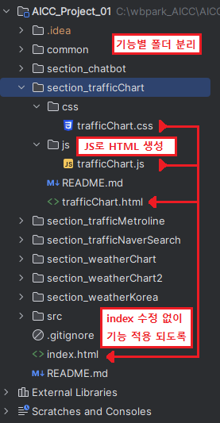
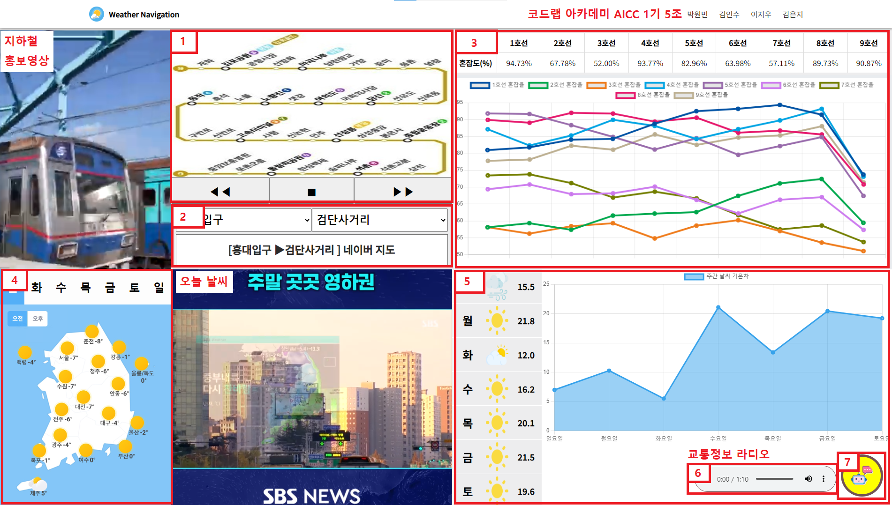

# Codelabit_AICC_Project_01
- 기간 : 2024.01.12.(금) ~ 01.18.(목) (5근무일)
- 주제 : 날씨 교통 테마 웹페이지 제작하기  
- 인원 : 박원빈, 김인수, 이지우, 김은지

#### STEP1 : 레이아웃 구성. 담당 영역 분할
- 협업 시 작업 영역과 책임 분리
- Git을 통한 실시간 업무 공유
- 통합 과정에서 개발자간 충돌 방지를 위한 요령

#### STEP2 : 기능 구현 및 디자인 확정
- 기능 구현 및 빠른 결과물 완성
- 개발된 페이지에서 신규 기능 추가 기존 기능 고도화

#### STEP3 : JS-JQUERY로 빈 HTML에 항목 생성하도록
- 완성된 HTML 리팩토링. DOM/JQuery로 HTML 생성하도록 변환
- 브라우저 보안정책을 준수하여 JS로 분리된 HTML요소 통합
- JQuery의 Select / effect / event 전체적인 복기

#### 리소스 출처
공공/무료 이미지, ai 생성 이미지, youtube-studio:non copyright music

- 지하철노선도 : https://www.seoulmetro.co.kr/kr/
- 생성 이미지 : https://picsart.com/create/
- 날씨 오디오 : https://studio.youtube.com
- 날씨 아이콘 : https://www.flaticon.com/kr/free-icon
- 쳇봇 아이콘 : https://www.flaticon.com/kr/free-icon/chatbot_2040946

---
#### 완성된 페이지 프리뷰


#### Git History - 개인별 기여내역


#### 폴더구조 : 협업 전략, 책임 분리

 1. 같은 파일 동시 수정 방지를 위해 기능별 작업폴더 분리
 2. 하나의 기능은 하나의 인원이 전담하여 개발 진행
 3. 개발된 기능은 플러그인화 시켜서 배포
 4. index.html 은 해당 개발 영역읜 js/css 참조를 통해 기능 적용


#### 기능별 세부 안내 


#### 1. trafficMatroLine 
- 내용 : 도권 지하철 노선도 보기
- 기능 : 이미지 슬라이더 
  - 이전버튼 : 현재-1 호선 노선도 보기
  - 다음버튼 : 현재+1 호선 노선도 보기
  - 자동넘김 : 1초당 다음 버튼 자동 클릭
- 주요 코드
```js
// 다음 버튼 
function traffic_Move() {
    traffic_slide_gallery_Xoffset -= TRAFFIC_IMAGE_WIDTH
    if (traffic_slide_gallery_Xoffset < -8*TRAFFIC_IMAGE_WIDTH) {
        traffic_slide_gallery_Xoffset = 0
    }
    $('#traffic_slide_gallery').animate({'marginLeft': `${traffic_slide_gallery_Xoffset}px`}, 300)
}
// 자동 넘기기 및 멈춤 버튼 : 
function traffic_play() {
  if (intervalId === null) {
    // 1초마다 넘기기 실행, 중지 버튼으로 스위치
    intervalId = setInterval(traffic_Move, 1000);
    $('#traffic_playToggle').text('■')
  } else {
    // 1초마다 넘기기 중지, 재생 버튼으로 스위치
    clearInterval(intervalId);
    intervalId = null
    $('#traffic_playToggle').text('▶')
}


```

#### 2. trafficNaverSerch
- 내용 : 지하철 길찾기
- 기능 : 외부링크
  - 출발역, 도착역 선택 시 naver 지도 연결 링크 생성
- 주요 코드
  
```js
// 지하철 코드 정보 등록
const traffic_NaverData = {
  "가산디지털단지":"172,746",
  "홍대입구":"239,4003,1609",
  "석남":"761,20222",
  "검단사거리":"711",
  "인천시청":"20124,20230"
}
// 선택된 역 정보 가져오기 
const startCode = $('#traffic_start')[0].value
const endCode = $('#traffic_end')[0].value

// 입력값 검증 로직 생략 : 소스코드 참고 바람

// 외부링크 생성 코드
const ULR = `https://map.naver.com/p/subway/1000/${startCode}/${endCode}/-`

// 외부링크 적용
$("#traffic_pathFinder_result").attr('href',ULR)
```
#### 3. trafficChart
- 내용 : 임의의 숫자를 불러와서 혼잡도 표시
- 기능 : ChartJS 로 차트 표시
  - 각 호선은 (-5% ~ 5%) 내외로 혼잡도 변화
  - 렌덤 범위 제한 : 혼잡도가 100% 넘기면 5% 차감, 50% 이하면 5% 추가 


#### 4. weatherKorea
- 내용 : 요일 & 오전/오후 전국날씨 표시
- 기능 : 버튼 클릭을 받아 이미지의 경로 수정 
- 주요코드 

```js
function weather_setImageSrc(day,time){
    // day : 월화수목금토일 | time : 오전,오후
    $('#weather_koreaImg').attr('src',`src/전국날씨_${day}_${time}.jpg`)
}
```

#### 5. weatherChart
- 내용 : 주간 요일별 날씨 및 기온 예측
- 기능 : Chart 로 표 표시
  - 각 요일별 날씨 예측
  - 날씨에 해당하는 랜덤 범위로 기온 예측
- 주요코드
```js
const weatherChartData = {
    '맑음': [8, 10, 'src/brightness.png'],
    '흐림': [5, 7, 'src/sun.png'],
    '비': [3, 6, "src/rain.png"],
    '눈': [-3, 5, "src/snow.png"],
    '바람': [4, 5, "src/wind.png"]
}
// 범위 내 랜덤 숫자 뽑기
function getRandomInterval(min, max) { 
  return Math.random() * (max - min) + min;
}
// 임의의 날짜 뽑기
function getRandomWeather() { // 
      const keys = Object.keys(weatherChartData)
      return weatherChartData[keys[Math.floor(getRandomInterval(0, keys.length))]]
  }
// 업데이트
function updateTempByRendom() {
    weaterChartData = []
    for (let i = 1; i < 8; i++) {
        const [minTemp, maxTemp, ImgSrc] = getRandomWeather();

        let randTemp = getRandomInterval(minTemp, maxTemp).toFixed(1);
        weaterChartData.push(randTemp);

        // 이미지 잡기
        $(`#wcTitle > div:nth-child(${i}) > img`).attr('src', ImgSrc)

        // 기온 잡기
        $(`#wcTitle > div:nth-child(${i}) > div.wcTemp`).text(randTemp)

    }
    tempChart.data.datasets[0].data = weaterChartData;
    tempChart.update();
}
```
#### 6. BGM
- 내용 : 교통정보 라디오 표시
- 기능 : Audio 테그 사용

#### 7. chatbot
- 내용 : 웹페이지의 기능을 안내하는 쳇봇 서비스
- 기능 : 대본 JSON 을 기준으로 사용자의 입력 받아 안내 수행
- 주요 코드 :
```js
const chatbotConversation = {
    botMessage: `코드랩 쳇봇입니다.<br>메뉴 번호를 입력해서 메뉴를 선택하세요.<br>▶ 교통 안내<br>▶ 날씨 안내`,
    botResponse: {
        "교통안내": {
            botMessage: `교통안내를 선택하셨습니다.<br>메뉴 번호를 입력해서 메뉴를 선택하세요.<br>▶ 처음으로<br>▶ 지하철 노선도<br>▶ 지하철 혼잡도<br>▶ 네이버 길찾기`,
            botResponse: {
                "지하철노선도": {botMessage: `지하철 호선 보기를 선택하셨습니다.<br>▶ 아무키나 입력하면 처음으로`, botFunction: "trafficMetroline"},
                "지하철혼잡도": {botMessage: `지하철 실시간 혼잡도 보기를 선택하셨습니다.<br>안내를 시작합니다.  아무키나 입력하면 처음으로`, botFunction: "trafficChart"},
                "네이버길찾기": {botMessage: `네이버 길찾기를 선택하셨습니다.<br>▶ 아무키나 입력하면 처음으로`, botFunction: "trafficNaverSearch"}
            }
        },
        "날씨안내": {
            botMessage: `날씨 안내를 선택하셨습니다.<br>메뉴 번호를 입력해서 메뉴를 선택하세요.<br>▶ 처음으로<br>▶ 요일별 날씨보기.<br>▶ 실시간 날씨보기`,
            botResponse: {
                "요일별날씨": {botMessage: `요일별 날씨 보기를 선택하셨습니다.<br>▶ 아무키나 입력하면 처음으로`, botFunction: "weatherKorea"},
                "실시간날씨": {botMessage: `실시간 날씨 보기를 선택하셨습니다.<br>▶ 아무키나 입력하면 처음으로`, botFunction: "weatherChart"}
            }
        },
    }
}


function resiveMessage(key) {

    // var messageContainer = document.getElementById('chatbot');
    var messageElement = $(`<div class='message assistant'>...Bot 응답 기다리는 중...</div>`);
    chatMessageContainer.append(messageElement);
    chatMessageContainer[0].scrollTop = chatMessageContainer.prop("scrollHeight");

    // 1초 쉬고 내용 작성
     setTimeout(function() {
        messageElement.html(chatLeftPopContext(key))
        chatMessageContainer[0].scrollTop = chatMessageContainer.prop("scrollHeight");
    }, 500);

}
function chatLeftPopContext(key){
    // '초기화' 입력되면 초기화
    if(key==='초기화'){
        chatContext = chatbotConversation;
        return chatContext.botMessage
    }
    if(!('botResponse' in chatContext)){
        // botResponse 가 없는 노드로 온 경우 아무 키나 입력해도 처음으로
        chatContext = chatbotConversation;
        return chatContext.botMessage
    }
    // 선택지 있다면 수행
    let resultMessage = ""
    if(key in chatContext.botResponse){
        chatContext = chatContext.botResponse[key]
        resultMessage = chatContext.botMessage
    }else{
        resultMessage = `주어진 선택지를 입력해주세요<br>선택지 목록: ${Object.keys(chatbotConversation.botResponse).join(' , ')}`
    }
    return resultMessage
}
```

---
### DAY5
##### 2022.1.18.(목)
  - 이지우 : 개발 완료된 기능 테스트
  - 김은지 : index 페이지 내 css 수정
  - 김인수 : BGM 및 영상 추가
  - 박원빈 : 결과발표, 업무일지 정리, 개발된 요소 크기 조정

---
### DAY4 
##### 2022.1.17.(수)
  - 이지우 : traffic 영역 배치 및 기능 점검
  - 김은지 : weatherChart 개발완료
  - 박원빈 : 업무일지 정리 및 기능개발 완료된 건 CSS 수정


---
### DAY3
##### 2022.1.16.(화)
##### 주요 이벤트 : 
  - AICC 팀별 개발 진행사항 발표
  - 김인수 : chatbot 초안작성
  - 김은지 : weatherChart 기능개발 착수
  - 이지우 : trafficChart 기능개발 완료
  - 박원빈 : chatbot 기능개발 완료

---
### DAY2
##### 2022.1.15.(월)
  - 김은지 : weatherKorea 기능개발 완료
  - 이지우 : trafficMetroline 기능개발 완료
  - 박원빈 : trafficNaverSearch 기능개발 완료
---
### DAY1
##### 2021.1.12.(금)
##### 인원별 주요업무 :
  - 김인수 : traffic 섹션 기획 및 개발 착수
  - 김은지 : index 영역 기획 및 개발 착수
  - 이지우 : weather 섹션 기획 및 개발 착수
  - 박원빈 : 폴더구조 제안, 업무 분배

### 기획 초안 
주요업무 : 
- 주제선정 : 날씨 & 대중 교통
- 업무분담 : 
  - 요소 별로 분업하여 개발 후 통합
  - 요소 별로 폴더 생성. 담당자별로 폴더 내부만 편집
  - 변수명 규칙을 통해 통합 후 출돌을 방지
- 기능명세 : 
  - 교통
    - 지하철 노선도 : 
      - [x] 이미지 리소스 확보 (1/12)
      - [x] 애니메이션 슬라이드 겔러리 (1/12)
      - [x] [오른쪽|왼쪽|자동]으로 노선도 이동
    - 지하철 길찾기(외부링크) : 
      - [x] 네이버 지하철 URL 페턴 분석 (1/15)
      - [x] 각 조원들이 자주 사용하는 지하철역 조사  (1/15)
      - [x] 출발역, 도착역, 경유역 설정하면 외부링크를 통해 길 찾아주도록 (1/15)
  - 날씨
    - 요일별 날씨 : 
      - [x] 이미지 리소스 확보 (1/12)
      - [x] 이미지 업데이트 버튼 개발 (1/15)
      - [x] 요일/오전오후 별로 이미지 업데이트 (1/15)
  - 기타
    - [x] 통합 레이아웃 구성 (1/12)
    - [x] BGM on/off
    - [x] 외부 링크 열기(JS/JQuery로 HTML생성)
